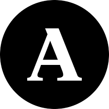

```{r setup, include=FALSE}
knitr::opts_chunk$set(echo = FALSE)

# Learn more about creating websites with Distill at:
# https://rstudio.github.io/distill/website.html

```

Bem vindos/as!

Este é o site da disciplina "processo constitucional", do 6º semestre do bacharelado em direito da Universidade Zumbi dos Palmares

# Informações básicas

- **Período:** primeiro semestre, 2025
- **Sala:** a definir
- **Horários:**
  - segundas, 21h00-22h35
  - quartas, 19h00-20h40
- **Professor:** Luccas Gissoni

# Apresentação

Todos nós conhecemos o direito constitucional: ele abriga os direitos fundamentais, a organização do Estado e a regulação da atividade econômica. Na intersecção dessas três áreas, está o programa de construção do Estado de bem estar social em nosso país. Contudo, como todo direito, não basta ao constitucional a positivação na lei: para ser efetivo, é necessária a previsão de ações judiciais que façam cumprir o direito.
Assim, além de direitos subjetivos materiais, a Constituição da República prevê uma série de possibilidades de provocação do Poder Judiciário cujo objetico é fazer valer os preceitos constitucionais. Ao conjunto desses direito de ação e ao procedimento judicial específico que eles conformam, chamamos **processo constitucional**.
O objetivo deste curso é entender esse processo. Mas, de início, iremos discutir o que é "processo", antes de adentrar o terreno do processo especificamente constitucional. O foco desta primeira parte do curso será teórico e histórico. Na segunda parte, apresentaremos procedimentos constitucionais especiais e praticaremos a redação de suas peças profissionais conforme as regras do Exame de Ordem da OAB.

# Bibliografia

```{r}
#biblio <- bibtex::read.bib("biliografia.bib")
#utilizar abaoxo
#`r capture.output(print(biblio["brasil_constituicao_1988"]))`
```

## Bibliografia básica

@dimoulis_curso_2016

## Bibliografia complementar

@mendes_curso_2024
@moraes_direito_2023
@padilha_como_2014

# Estrutura do curso

## Aulas, leituras e materiais

Teremos momentos de aulas expositivo-dialogadas em que discutiremos a bibliografia do curso. Neste site, também estarão disponíveis as notas de aula, elaboradas pelo professor, que servirão de material de apoio. A leitura de ambos os materiais é obigatória.

## Avaliação

A avaliação será dividida em dois bimestres, cada um dos quais contará com três **PAP**, cada uma valendo **1 ponto** e uma **PAT**, valendo **7 pontos**. A nota final será a **média aritmética** dos dois bimestres e haverá possibilidade de realização de **prova substitutiva** e **exame**. 

### PAP

As PAP constituirão 4 atividades ou trabalhos escritos individuais por bimestre. Cada uma valerá 1 ponto e a pior nota será **descartada**. As PAP serão realizadas em casa. Em geral, o **prazo** de entrega da atividade será no **domingo seguinte** à sua explicação em sala. Os textos devem ser obrigatoriamente digitados e entregues (em pdf, odt ou doc) no email [**luccas.gissoni@gmail.com**](mailto:luccas.gissoni@gmail.com), com assunto **"PCO - PAP x.y - NOME DO/A ESTUDANTE"**, onde "x.y" é a numeração da PAP.
Na primeira parte do curso, as PAP terão cunho teórico-histórico; na segunda parte, elas serão constituídas pela prática de redação das peças profissionais do processo constitucional conforme o Exame de Ordem. As PAP serão realizadas em sala ou em casa, conforme o caso.

### PAT

As PAT serão constituídas por dez **questões objetivas** valendo **5 pontos** e uma ou duas **questões dissertativas** valendo **2 pontos**. Todas serão baseadas na experiência de prova do Exame de Ordem e do ENADE.

# Plágio e uso indevido de IA em atividades acadêmicas

Prezados(as) alunos(as),  

O compromisso com a **autenticidade e integridade acadêmica** é essencial para seu aprendizado e desenvolvimento profissional. O uso indevido de **inteligência artificial (IA)** e a prática de **plágio** comprometem esse princípio e terão **consequências rigorosas**.

## Plágio

De acordo com o **art. 184** do **Código Penal** e normas acadêmicas, **apresentar como sua uma produção intelectual alheia, sem a devida citação, configura plágio**. Isso inclui:  

- Copiar trechos de livros, artigos, sites ou outros trabalhos sem a devida referência;  
- Parafrasear um texto sem indicar a fonte;  
- Apresentar como próprio um trabalho feito por terceiros.  

> **As atividades plagiadas serão anuladas e atribuídas nota zero.**

## Uso de inteligência artificial  

Ferramentas de IA podem auxiliar na pesquisa, mas **não substituem a construção do conhecimento próprio**. O uso de IA para gerar respostas prejudica sua autonomia acadêmica e seu preparo para avaliações futuras, como o **Exame de Ordem** e o **ENADE**, onde tais ferramentas não estarão disponíveis.  

> **A identificação do uso não autorizado de IA resultará na anulação da atividade.**

## Como garantir a originalidade do seu trabalho?

- Desenvolva suas respostas com base no material estudado e em sua própria reflexão;  
-️ Utilize fontes acadêmicas confiáveis e cite corretamente todas as referências;  
- Se tiver dúvidas sobre citação e integridade acadêmica, consulte o professor antes de entregar o trabalho.  

## Conscientização e compromisso  

A universidade valoriza a **produção autoral e o pensamento crítico**. O objetivo das atividades acadêmicas é fortalecer suas habilidades de argumentação, escrita e análise, que serão essenciais para sua trajetória profissional.  

 **Seja responsável pelo seu aprendizado!** Trabalhos autênticos refletem seu crescimento e garantem que você esteja verdadeiramente preparado para os desafios da carreira jurídica.  

**Dúvidas? Entre em contato!**  

# Sobre o professor

Possui graduação em Direito pela Universidade de São Paulo (2015), graduação em Filosofia pela Pontifícia Universidade Católica de São Paulo (2012) e mestrado em Economia Política Mundial pela Universidade Federal do ABC (2020). No momento, está no doutorado também por este mesmo programa. É pós-graduado em Processo Civil pela Fundação Getulio Vargas (2019). Atualmente é Professor de Direito na Universidade Zumbi dos Palmares, Analista de Políticas Públicas e Gestão Governamental na Secretaria Municipal de Mobilidade Urbana e Trânsito da Prefeitura de São Paulo e professor voluntário na Uneafro. Constrói o projeto "Novo Bandung: grupo de estudos sobre descolonização e emergência do Sul: África, Ásia e América Latina" na UFABC, bem como a Agrarian South Network, em Harare, Zimbábue, desenvolvendo pesquisa sobre a formação econômica e social do Brasil e da China. Foi coordenador de direito econômico e economia política da Comissão de Graduação, Pós-Graduação e Pesquisa da OAB/SP. Tem experiência nas áreas de Economia Política Mundial, Planejamento de Transportes, Filosofia e Direito, atuando principalmente nos seguintes temas: história econômica, teoria geral do direito, formação econômica e social do Brasil, história da África, desenvolvimento econômico e geopolítica na Ásia, segurança viária e planejamento cicloviário. Advogado em São Paulo.

## **Perfis acadêmicos e redes sociais**

{ width=2.5% } [Lattes](http://lattes.cnpq.br/3169916414077985)  
<i class="fa-brands fa-orcid"></i> [ORCID](https://orcid.org/0000-0003-3564-6269)  
<i class="fa-brands fa-researchgate"></i> [ResearchGate](https://www.researchgate.net/profile/Luccas-Gissoni?ev=hdr_xprf)  
{ width=2.25% } [Academia.edu](https://ufabc-br.academia.edu/LuccasGissoni)  
<i class="fa-brands fa-github"></i> [GitHub](https://github.com/lgissoni)  
<i class="fa-brands fa-square-twitter"></i> [Twitter](https://x.com/luccas_loki)  
